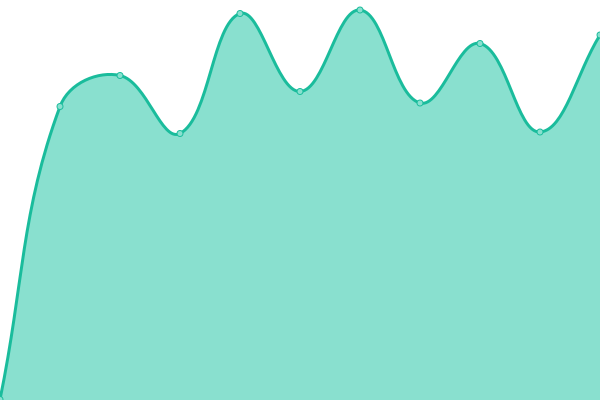
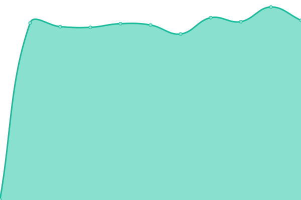

# [📈 Live Status](https://Hokutosei.github.io/HexaUptime): <!--live status--> **🟩 All systems operational**

This repository contains the open-source uptime monitor and status page for [jeanepaul](https://Hokutosei.github.io/HexaUptime), powered by [Upptime](https://github.com/upptime/upptime).

With [Upptime](https://upptime.js.org), you can get your own unlimited and free uptime monitor and status page, powered entirely by a GitHub repository. We use [Issues](https://github.com/Hokutosei/HexaUptime/issues) as incident reports, [Actions](https://github.com/Hokutosei/HexaUptime/actions) as uptime monitors, and [Pages](https://Hokutosei.github.io/HexaUptime) for the status page.

<!--start: status pages-->
<!-- This summary is generated by Upptime (https://github.com/upptime/upptime) -->
<!-- Do not edit this manually, your changes will be overwritten -->

| URL                                                              | Status | History                                                                                                                 | Response Time                                                                               | Uptime                                                                                                                                                                                                                                                  |
| ---------------------------------------------------------------- | ------ | ----------------------------------------------------------------------------------------------------------------------- | ------------------------------------------------------------------------------------------- | ------------------------------------------------------------------------------------------------------------------------------------------------------------------------------------------------------------------------------------------------------- |
| [Hexabase Staging Login](https://az.hexabase.com/login)          | 🟩 Up  | [hexabase-staging-login.yml](https://github.com/Hokutosei/HexaUptime/commits/master/history/hexabase-staging-login.yml) |  650ms |  |
| [Hexabase Staging API](https://az-api.hexabase.com/health_check) | 🟩 Up  | [hexabase-staging-api.yml](https://github.com/Hokutosei/HexaUptime/commits/master/history/hexabase-staging-api.yml)     |  525ms   |      |
| [Community Site](https://community.hexabase.com)                 | 🟩 Up  | [community-site.yml](https://github.com/Hokutosei/HexaUptime/commits/master/history/community-site.yml)                 |  692ms         |                  |

<!--end: status pages-->

[**Visit our status website →**](https://Hokutosei.github.io/HexaUptime)

## 📄 License

- Code: [MIT](./LICENSE) © [jeanepaul](https://Hokutosei.github.io/HexaUptime)
- Data in the `./history` directory: [Open Database License](https://opendatacommons.org/licenses/odbl/1-0/)
